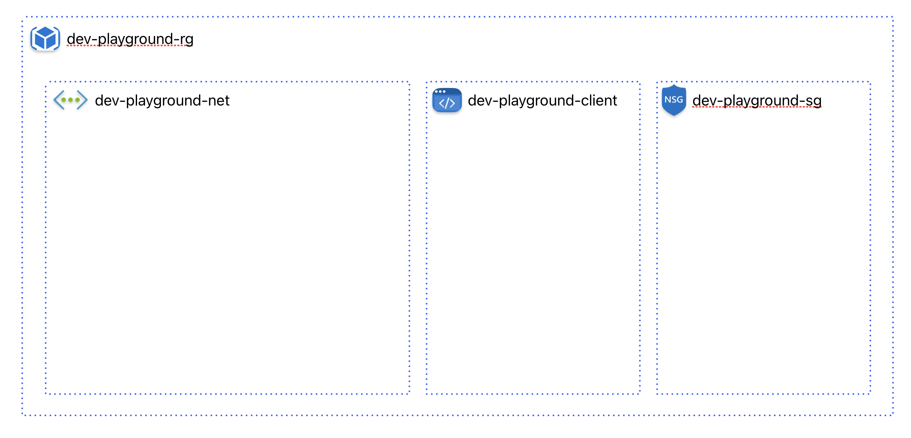

# terraform-azure

### 🧱 System Architecture

🐾 How to run the program
1. Install [Terraform](https://developer.hashicorp.com/terraform/install?product_intent=terraform) in your computer.
2. Install [Azure](https://learn.microsoft.com/en-us/cli/azure/install-azure-cli) CLI in your computer.
3. [Login](https://learn.microsoft.com/en-us/cli/azure/authenticate-azure-cli-interactively) your Azure account.
4. run `terraform init` from your project root directory to initiate all the files needed.
5. run `terraform plan` to identify the changes to resources.
6. Set sensitive variables by running `export TF_VAR_[variable name]="[value]"`. Existing variable names can be found in `variables.tf` which does not have default values and are sensitive in nature.
7. Lastly run `terraform apply -auto-approve` in order to commit and push the changes to your Azure resources.

*Resources used in this repository are free of charge.*